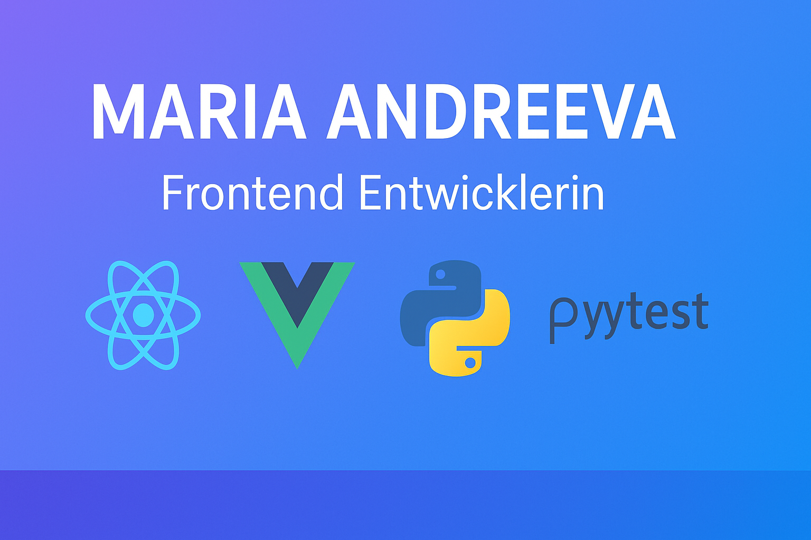

# 💻 Maria Andreeva — Frontend Entwicklerin | Frontend Developer

---

## 🇩🇪 Über mich

👋 Hallo! Ich bin **Maria Andreeva**, eine leidenschaftliche **Frontend-Entwicklerin** mit Fokus auf **React**, **Vue.js** und **automatisierte Tests in Python**.  
Nach über 10 Jahren Erfahrung im **Marketing** habe ich meine Karriere neu ausgerichtet und entwickle heute **moderne, performante und benutzerfreundliche Web-Anwendungen**.

- 🎓 **Ausbildung:**  
  - GeekBrains (Frontend-Entwicklung, 2023–2025)  
  - Skillbox (Automatisiertes Testen in Python, 2024–2025)
- 💼 **Aktuell:** Frontend-Entwicklerin bei **Akatosphere GmbH** (seit April 2025)  
- 💡 Interessen: UX/UI, Performance-Optimierung, Testing  
- 🌱 Lernend: TypeScript, Next.js, Playwright  

---

### 🧠 Technische Fähigkeiten

| Bereich | Technologien |
|----------|---------------|
| **Frontend** |     |
| **Styling** |   |
| **Testing & Backend** |    |
| **Tools** |     |

---

### 💼 Projekte

#### 🧩 [Portfolio Website](#)
> Erstellt mit **React** und **Tailwind CSS** - persönliche Website mit responsivem Design, React Router und modernen Komponenten.

#### ✅ [To-Do-App](https://github.com/Maria-Andreeva/MeetingSchedulerApp)
> Geschrieben in **React** - Aufgabenmanagement mit CRUD-Funktionalität und LocalStorage.

#### ☁️ [Wetter-App](#)
> API-Integration mit OpenWeatherMap - Echtzeit-Wetterdaten mit Hooks in React.

---

## 🇬🇧 About Me

👋 Hi there! I'm **Maria Andreeva**, a **Frontend Developer** passionate about **React**, **Vue.js**, and **automated testing with Python**.  
After 10+ years in **marketing**, I switched careers to tech and now create **modern, accessible, and efficient web applications**.

- 🎓 **Education:**  
  - GeekBrains (Frontend Development, 2023–2025)  
  - Skillbox (QA Automation with Python, 2024–2025)
- 💼 **Currently:** Frontend Developer at **Akatosphere GmbH** (since April 2025)  
- 💡 Interested in: UX/UI, performance optimization, and clean code  
- 🌱 Currently learning: TypeScript, Next.js, Playwright  

---

### 🧠 Tech Stack

React • Vue • JavaScript • TypeScript • HTML • CSS • SCSS • Tailwind • Python • Pytest • Selenium • Git • Figma • Next

---

### 📫 Contact

📧 **E-Mail:** [maria.andreeva.marketing@gmail.com](mailto:maria.andreeva.marketing@gmail.com)  
💼 **LinkedIn:** [linkedin.com/in/maria-andreeva-094927198](https://www.linkedin.com/in/maria-andreeva-094927198/)  
💻 **GitHub:** [github.com/Maria-Andreeva](https://github.com/Maria-Andreeva)

---

✨ _„Code ist wie Kunst – jedes Detail zählt.“_

